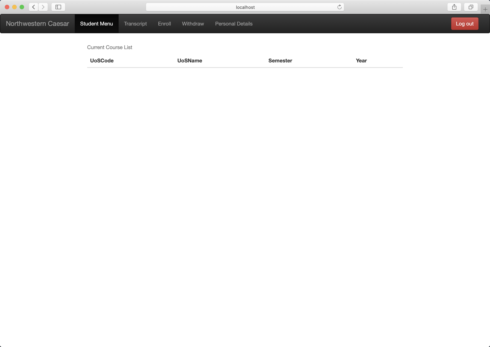
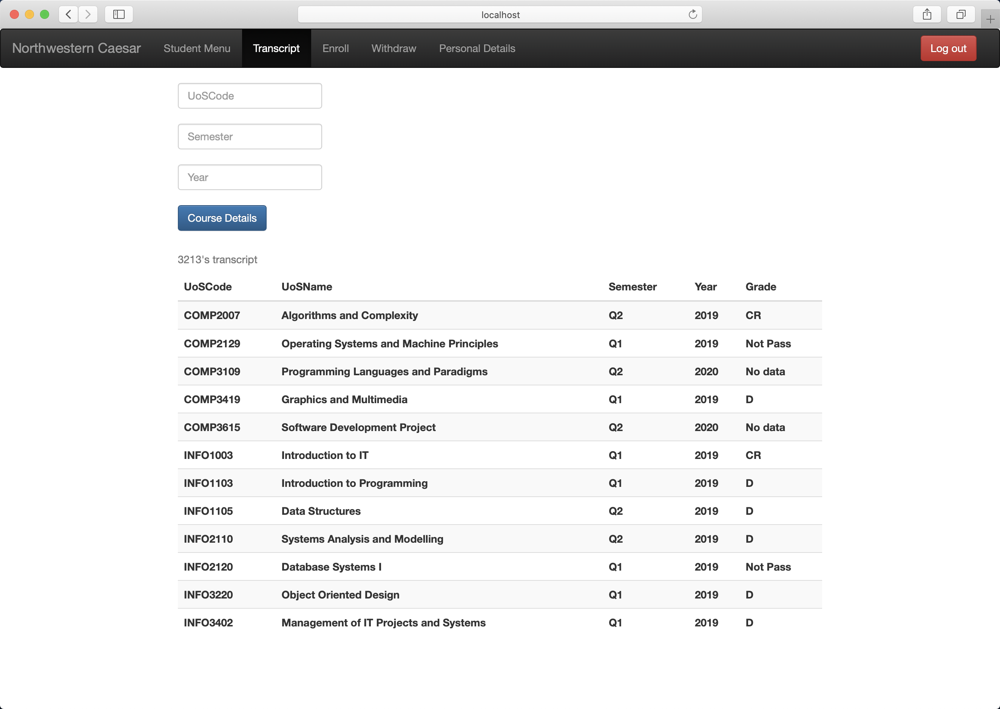
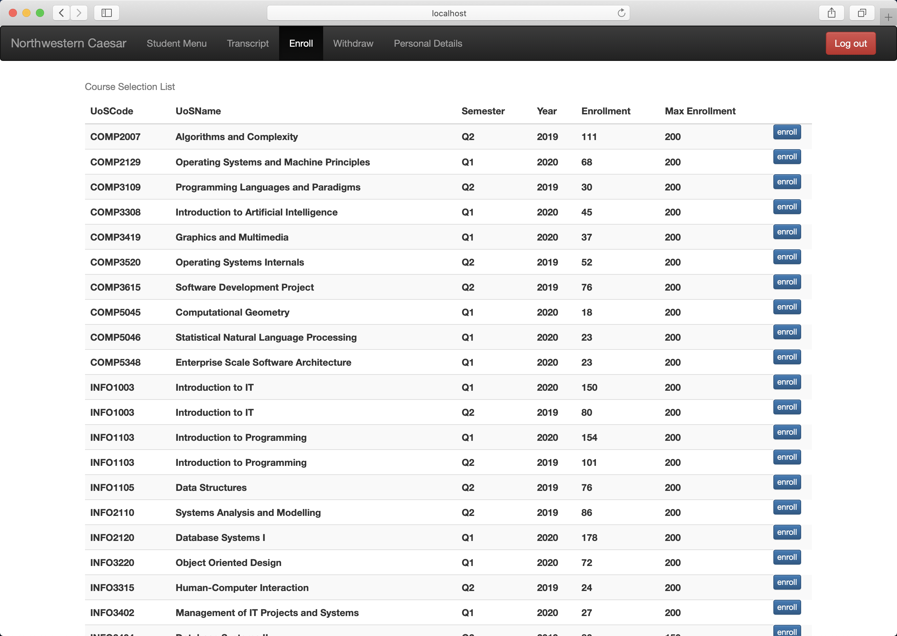
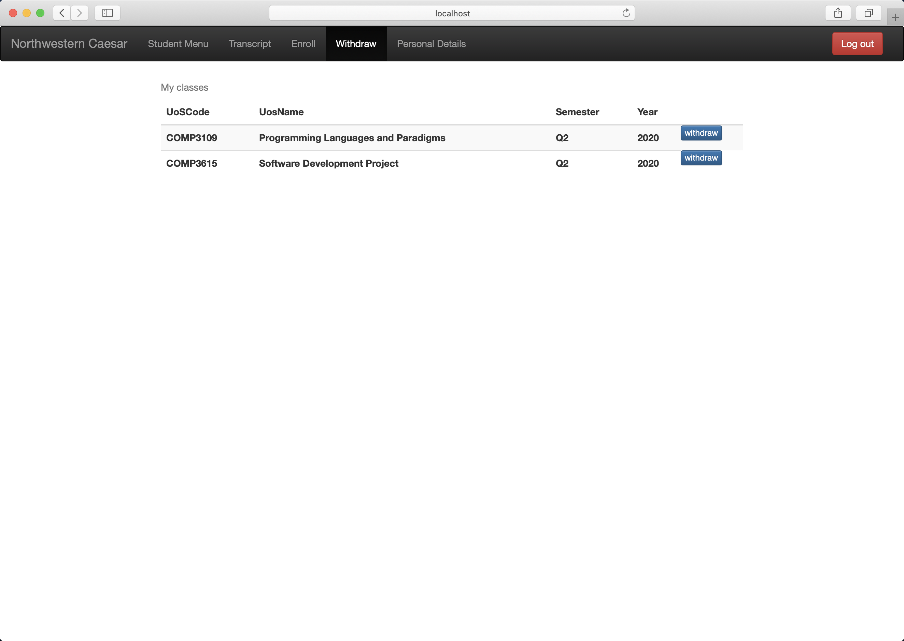
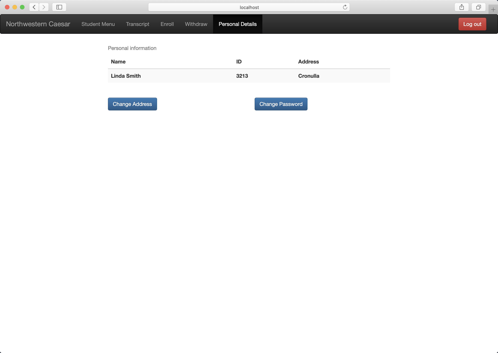

# Simulation: Northwestern Caesar's academic system

## Introduction 

This project implements something along the lines of Northwestern Caesar’s academic system. Students can use the system to know their current courses and transcripts, to enroll some courses which satisfies prerequisite, to withdraw their courses and to modify their personal information.

## How to use

1. Import data in mysql using project3-nudb.sql. If you use mysqlWorkbench, follow these steps. Server -> Data Import -> Import from Self-Contained file -> Choose project3-nudb.sql -> Start import. Then, restart mysqlWorkbench.
   
2. In the file Application.properties, you should change these two parameters according your mysql setting:  
spring.datasource.username= ***  
spring.datasource.password= ***

3. Using scripts in [P3-sql-script](/CE495-Introduction-to-Database-Systems-and-Data-Warehousing/db_application/P3-Sql-script/) to create triggers and stored procedures.

4. Finally, you can start this spring boot project and visit localhost:19495/login.html. If failed in this step, please try to clean dependencies and reinstall all dependencies.

## Features

 - RESTful API
 - Stored Procedures
 - Triggers
 - Ajax

## Requirements

You can find details of requirements in Assignment.docx.

 - Login Page
   - Students use username and password to login.
   - When successfully logged in, students shall be directed to the Student Menu screen. 
   - If username or password is incorrect, an appropriate error message shall be given.
 - Student Menu Page
   - Course List (this quarter and year)
   - Logout button
 - Transcript Page
   - Transcript with all courses and grades.
   - The courses currently being taken are also in the transcript but the grades are NULL.
   - The student should be provided with an option to see details of any of the courses listed in the transcript.
 - Enroll Page
   - **Implement this part using stored procedures and call it from your database client program.**
   - enroll in a new course which satisfies prerequisites.
   - On successful enrollment, a new entry in the Transcript table shall be created
   - Only subject offerings of the current year and quarter or the following quarter shall be presented.
   - If student cannot enroll because he/she has not cleared the prerequisites, print those prerequisites on the screen.
   - If the Enrollment number goes below 50% of the MaxEnrollment, then a warning message should be shown on the screen. **Implement this using Triggers.**
 - Withdraw Page
   - **Implement this part using stored procedures and call it from your database client program.**
   - withdraw from a course that they are currently enrolled in.
   - If successful, the corresponding Transcript entry shall be removed.
   - If successful, the current Enrollment number of the corresponding course shall be decreased by one.
 - Personal details Page
   - allow change password.
   - allow change address.

## Architecture

## Login page

## Student Menu Page

The student does not enroll in any courses.

## Transcript Page

In case of grades, "P", "CR", "D" means the student passed and completed the course. "No data" means the course is in current quarter or next quarter.

## Enroll Page

## Withdraw Page

## Personal Details Page

## Main Techniques used in this project

 - Java 8
 - Spring Boot
 - Spring Boot JDBC
 - Mysql 5.7
 - Bootstrap 3
 - Ajax
 - HTML, Javascript

