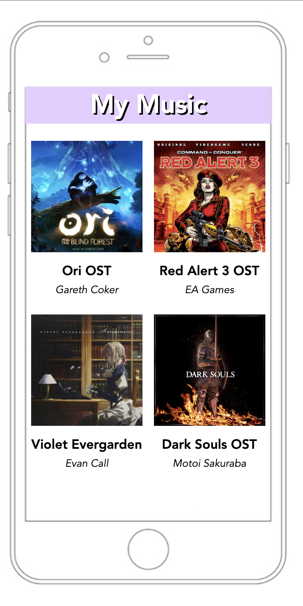
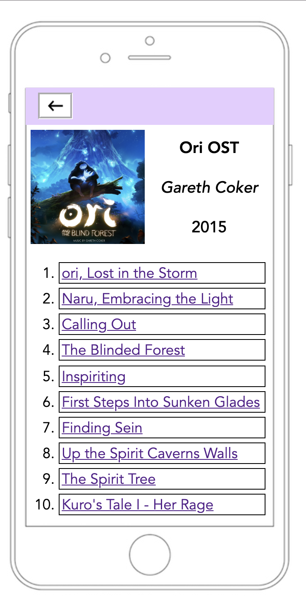

# Music Player UI : album page and songs page

## Introduction

This is the first programming assignment of CS330 HCI.  

## Requirements
The requirements of the assignment contain two parts. 

 - Album Select Layout
   - The screen should contain covers of four different albums as well as the album name and artist name.
   - Have one album cover (the one in the upper-lefthand corner) link to the next page called songs.html (an HTML page that you will create in the next part). You only need to create one songs.html page for one album.

 - Song Select Layout
   - to implement the song select screen of this music player
   - This second screen should contain the track listing of 10 songs found on a mock-up album.
   - The back button on this screen should be functional and lead back to the former page.

## Solution

The solution of the first requirement is [albums.html](/albums.html).  

The solution of the second requirement is [songs.html](/songs.html).

