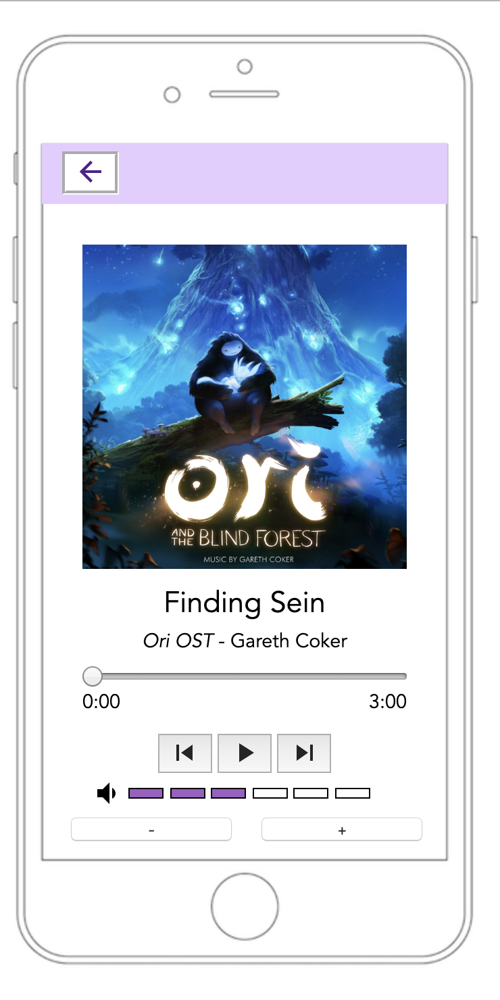

# Music Player UI : player page

## Introduction

This is the second programming assignment of CS330 HCI.

## Requirements

 - Songs Player Layout
   - The screen contains the cover of the album, name of the song and the name of the artist.
   - Progress bar shows time.
   - Click progress bar to change time.
   - There are three buttons, stop button, switch previous songs button and switch next songs button.
   - There are two buttons to change volumes.
   - The button can lead to [previous pages](/CS330-HCI/ipod-starter)

## Solution

The solution of the requirement contains [player.html](/CS330-HCI/starter2/player.html), [ipod.js](/CS330-HCI/starter2/ipod.js) and [ipod.css](/CS330-HCI/starter2/ipod.css).

